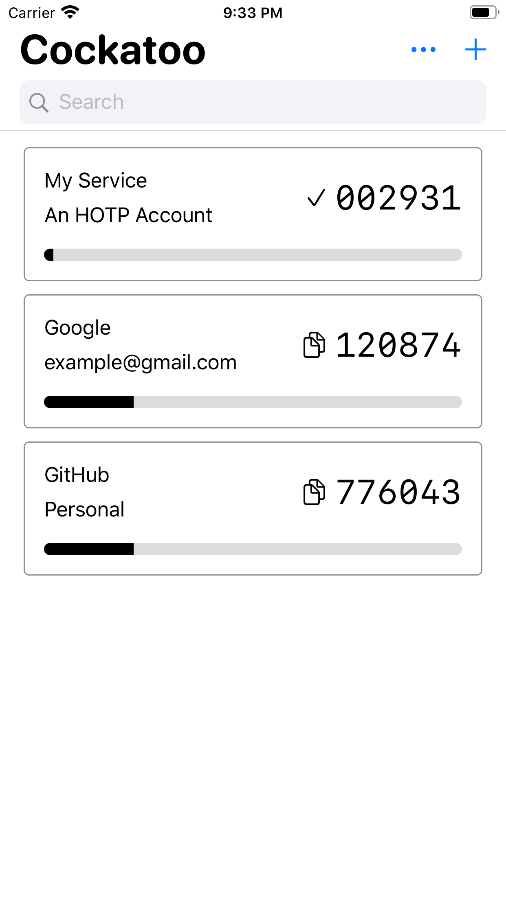

# Cockatoo

Cockatoo is a minimalist iOS app that provides one-time password for all your online services.

* Cockatoo offers a minimalistic two factor authentication service.

* Cockatoo respects your privacy (and bandwidth!) by never access the network.

* Cockatoo does not lock you in by offering freedom of migration between Cockatoo itself and Google Authenticator.

* Cockatoo works well with dark mode, too!

## Features
* Minimalist design with native UI components.
* Import from and export to Google Authenticator at bulk with ease.

Join our discussion on matrix: <a href="https://matrix.to/#/!VORkdtvGshHrUmtXLZ:matrix.org?via=matrix.org&via=shumink.xyz">#cockatoo:matrx.org</a>.
